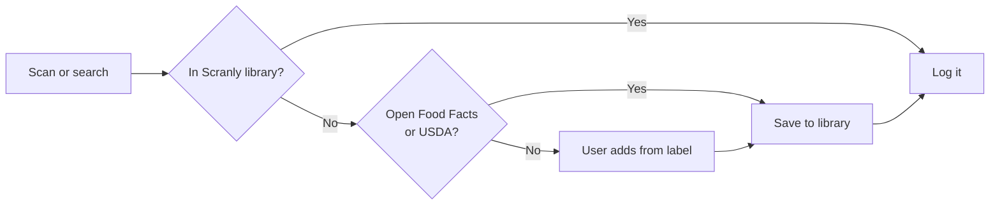

# Scranly — Product Requirements

Sep 21, 2026 · @Ezekiel Follykoe Ayikoe

## Overview

Scranly is a free, no-ads food and calorie tracker, built for Kyel first and then shared with friends. It copies the core LoseIt loop: set a goal, get a daily calorie budget, log what you eat, see where you stand.

It is not a startup and has no app-store plans for now. The bar is simple: logging a meal should take under 10 seconds, and the app should still be in use after a month.

Pitch: *Scranly — log your food in seconds, keep your data, pay nothing.*

## Goals and non-goals

The goal is a tracker Kyel uses every day, that friends can join by invite, and that gets to more than 20 active users before any wider launch is considered.

**Goals**

- Fast daily logging: barcode, search and one-tap re-log of recent foods
- A clear daily calorie budget, with protein, carbs and fat alongside
- Weight tracking against a goal, with a trend line
- A shared food library, so a food one friend adds is there for everyone
- Full data ownership: export everything as CSV at any time

**Non-goals for now**

- App-store release, payments or subscriptions
- Social feeds, challenges or leaderboards
- Photo-based AI food recognition
- Exercise tracking beyond a manual calorie entry
- Coaching, meal plans or medical advice

**Success measures**

| Measure | Target |
| --- | --- |
| Kyel logs food | 6 or more days a week for 4 weeks |
| Time to log a repeat food | Under 5 seconds |
| Time to log a scanned product | Under 10 seconds |
| Barcode scans that find a match | 70% or more of UK products scanned |
| Active users (logged in the last 7 days) | More than 20 — the point to consider a wider release |

## Users

Kyel is the first user, and every decision should make his daily logging faster. Friends come next, invited one by one.

| User | Who | What they need |
| --- | --- | --- |
| Kyel | Founder, UK-based, serious about what he eats | Speed, accurate numbers, his own data, no subscription |
| Invited friends | Similar habits, mostly UK | Easy setup with no store install, UK products that scan, privacy from other users |

Each user's diary and weight are private. The only shared thing is the food library.

## Reference model: LoseIt

Scranly keeps LoseIt's core loop and drops most of what sits around it. The comparison below is based on LoseIt's publicly known features, not a feature-by-feature audit.

| LoseIt feature | Scranly | Why |
| --- | --- | --- |
| Goal weight and date gives a daily calorie budget | Keep | This is the core of the app |
| Food log by meal (breakfast, lunch, dinner, snacks) | Keep | Familiar and easy to scan back through |
| Barcode scanning | Keep | Fastest way to log packaged food |
| Food search | Keep | Needed for unpackaged food |
| Recent and frequent foods | Keep, make it the default screen | Most people eat the same foods again and again |
| Custom foods and recipes | Keep (recipes in phase 2) | Fills gaps in the database |
| Macro tracking | Keep, free | Behind a paywall in LoseIt |
| Weight log and progress chart | Keep | Shows whether the budget is working |
| Snap It photo logging | Drop for now | Hard to make accurate; revisit later |
| Exercise tracking and device sync | Manual entry only | Device sync adds a lot of work for little gain early on |
| Challenges, social, ads, upsells | Drop | Not what Scranly is for |
| Data export | Keep, free and complete | Owning your data is a reason to build Scranly |

## MVP features

The MVP covers only what Kyel needs to log every day. P0 must ship; P1 ships before friends are invited.

| # | Feature | Requirement | Priority |
| --- | --- | --- | --- |
| F1 | Profile and goal | Choose a method (bodyweight or Mifflin–St Jeor), enter the inputs it needs and a goal weight; get daily calorie, protein, fat, carb and fibre targets | P0 |
| F2 | Today screen | Budget, eaten and remaining calories, plus protein, carbs, fat and fibre; foods grouped by meal | P0 |
| F3 | Recent foods | One tap re-logs a recent food with its last-used portion | P0 |
| F4 | Barcode scan | Camera scan looks up the product; shows nutrition per 100 g and per serving before logging | P0 |
| F5 | Search | Searches your foods, the shared library, then Open Food Facts and USDA | P0 |
| F6 | Add a missing food | Enter values from the pack label in under 30 seconds; saved to the shared library | P0 |
| F7 | Portions | Grams, servings, or common units (slice, cup); edit after logging | P0 |
| F8 | Weight log | Enter weight; all targets recalculate; chart with a 7-day moving average | P0 |
| F14 | Scale photo | Photo of the scale display; Scranly reads the weight, the user confirms, targets update | P1 |
| F9 | Quick add | Log calories (and optional macros) with no food attached | P1 |
| F10 | History | Browse and edit any past day | P1 |
| F11 | Invites and accounts | Invite-only sign-up by link; each diary private | P1 |
| F12 | Export | Download diary, weights and custom foods as CSV | P1 |
| F13 | Manual exercise | Add calories burned; setting to count it toward the budget or not | P1 |

## Calorie budget logic

Scranly supports two methods. Kyel's bodyweight method is the default: every target comes from weight alone, so a new scale reading is the only input needed. Mifflin–St Jeor is the alternative for users who want height, age and activity counted.

**Method A — Bodyweight method (default)**

| Step | Rule | Example at 83 kg |
| --- | --- | --- |
| 1. Weight in lb | kg × 2.2 | 183 lb |
| 2. Calories | lb × 10 | 1,830 kcal |
| 3. Protein | lb × 0.8 g | 146 g |
| 4. Fat | lb × 0.3 g | 55 g |
| 5. Fibre | 14 g per 1,000 kcal | 26 g |
| 6. Carbs | (calories − protein × 4 − fat × 9) ÷ 4 | 188 g |

The handwritten version gives 167 g for step 6; the rule as written gives 188 g. To confirm which is intended.

**Method B — Mifflin–St Jeor**

**1. Resting burn (BMR)**, weight in kg, height in cm, age in years:

```latex
\text{BMR} = 10w + 6.25h - 5a + s, \quad s = +5 \text{ (male)},\; -161 \text{ (female)}
```

**2. Daily burn (TDEE)** = BMR × activity factor: 1.2 sedentary, 1.375 light, 1.55 moderate, 1.725 very active.

**3. Budget** = TDEE − deficit, using about 7,700 kcal per kg of body fat (an approximation):

| Weekly rate | Daily deficit (approx.) |
| --- | --- |
| Maintain | 0 kcal |
| 0.25 kg a week | 275 kcal |
| 0.5 kg a week | 550 kcal |
| 0.75 kg a week | 825 kcal |
| 1 kg a week | 1,100 kcal |

**Rules**

- Recalculate the budget each time a new weight is logged.
- Never set a budget below a safety floor (default 1,200 kcal, to be confirmed), and warn if the chosen rate would need it.
- For Method B, default macro split 30% protein, 40% carbs, 30% fat, editable per user; protein can also be set in g per kg.
- Show these as estimates. Scranly gives no medical advice.

## Food data strategy

Scranly checks its own shared library first, then public databases, then asks the user to add the food. Every food found outside the library is copied into it, so the library grows around what the group actually eats.

| Source | Used for | Notes |
| --- | --- | --- |
| Scranly library | Everything already logged or added by the group | Checked first; fastest and most trusted |
| [Open Food Facts](https://world.openfoodfacts.org/data) | Packaged products by barcode or name | Free, volunteer-built; UK coverage is good but has gaps; requires credit (ODbL licence) |
| [USDA FoodData Central](https://fdc.nal.usda.gov/api-guide/) | Generic whole foods (banana, rice, chicken breast) | Free, public domain, reliable; branded items mostly American |
| User entry | Anything not found | Values typed from the pack label |



Each food is tagged with where it came from. Any user can flag or fix a wrong value; the fix applies to the shared copy.

**Before building:** scan 10 packaged items from your kitchen on the Open Food Facts site. If 7 or more are found and correct, this plan holds.

## Key user flows

Four flows cover almost all daily use. The logging flows should each take a few taps.

**1. Onboarding (once, about 2 minutes)**

1. Open the invite link and sign in.
2. Choose a method and enter current weight (Mifflin–St Jeor also asks for sex, age, height and activity level).
3. Choose goal weight and weekly rate; see the daily budget.
4. Land on the Today screen.

**2. Log a food you've had before (under 5 seconds)**

1. Tap + on a meal.
2. Recent foods show first; tap one.
3. It logs with the last portion used. Tap again to change the portion.

**3. Log a packaged product (under 10 seconds)**

1. Tap + then Scan.
2. Point the camera at the barcode.
3. Found: check the portion and tap Log. Not found: take a photo of the label for reference and type in the values, then log.

**4. Daily review**

1. Open Scranly; the Today screen shows remaining calories and macros.
2. Once a week, log weight; the budget updates and the trend chart moves.

## Technical approach

Scranly is a native app for iOS and Android, built once with bare React Native (the React Native CLI, not Expo) in TypeScript, and backed by a hosted Postgres database. Friends install test builds, with no public app-store listing.

| Layer | Choice | Why |
| --- | --- | --- |
| App | React Native 0.87 (CLI), TypeScript, one codebase | Real iOS and Android apps with full control of the native projects |
| Barcode scanning | A native camera library with barcode support (e.g. react-native-vision-camera) | Fast, reliable scanning on both platforms |
| Sharing with friends | iOS: TestFlight. Android: an installable build or Play internal testing | No public listing needed; TestFlight requires a paid Apple Developer membership |
| Backend | Supabase (Postgres, sign-in, row-level security) | Free tier is enough for 20 users; privacy rules live in the database |
| Food lookups | Server calls to Open Food Facts and USDA, results cached | Keeps API keys private and repeat lookups fast |
| Offline | Cache recent foods and today's log on the phone | Logging still works with a weak signal |

While it's just Kyel, the app can go on his own iPhone straight from Xcode with a free Apple account; builds signed this way expire after about a week and need re-installing. The paid membership is only needed once friends join.

**Data model**

| Table | Key fields | Who can see it |
| --- | --- | --- |
| users | id, name, sex, birth year, height\_cm, activity, goal\_weight\_kg, weekly\_rate, macro split | Owner only |
| foods | id, name, brand, barcode, kcal/protein/carbs/fat per 100 g, serving size, source, added\_by | All users |
| log\_entries | id, user\_id, food\_id, date, meal, grams, kcal and macros at log time | Owner only |
| weights | id, user\_id, date, weight\_kg | Owner only |
| exercise | id, user\_id, date, name, kcal | Owner only |
| invites | code, created\_by, used\_by | Admin |

Log entries store the calories and macros at the time of logging. Later fixes to a shared food then don't change past days.

## Later phases

Each phase starts only once the one before is in daily use.

| Phase | When | What |
| --- | --- | --- |
| 1 — MVP | Kyel alone | P0 features; Kyel logs daily for 2 weeks |
| 2 — Friends | First 5 invites | P1 features; recipes and saved meals; copy yesterday's meal |
| 3 — Habits | 10+ users | Weekly summary, streaks, reminders, water tracking; smart-scale sync from Apple Health and Health Connect, with body fat % and the Katch–McArdle formula as an option |
| 4 — Decide | More than 20 active users | Decide whether to publish to the App Store and Google Play, or add photo logging. Parked idea: estimating height from a full-length photo |

## Risks and open questions

The biggest risk is that logging feels slower than LoseIt and Kyel stops using Scranly. The second is that Scranly pulls time away from Klone.

| Risk | Fallback |
| --- | --- |
| UK barcode coverage too patchy | Fast manual entry; the shared library fills gaps over time |
| Apple membership cost and TestFlight setup for iPhone friends; more native setup work without Expo | Invite Android friends first; add iPhone friends once Scranly is in daily use |
| Wrong nutrition values in shared foods | Show the source; let users flag and fix values |
| Side project grows into a second job | Timebox the MVP to 2 weekends; if it isn't useful by then, stop |
| Health data is sensitive | Invite-only, private diaries, row-level security, full export and delete |

**Open questions**

- [ ] Platform: native iOS and Android with bare React Native CLI (decided)
- [ ] What safety floor for the minimum daily budget?
- [ ] Should exercise calories add to the daily budget by default?
- [ ] Metric only, or also stones and pounds for weight?
- [ ] Result of the 10-item Open Food Facts kitchen test
